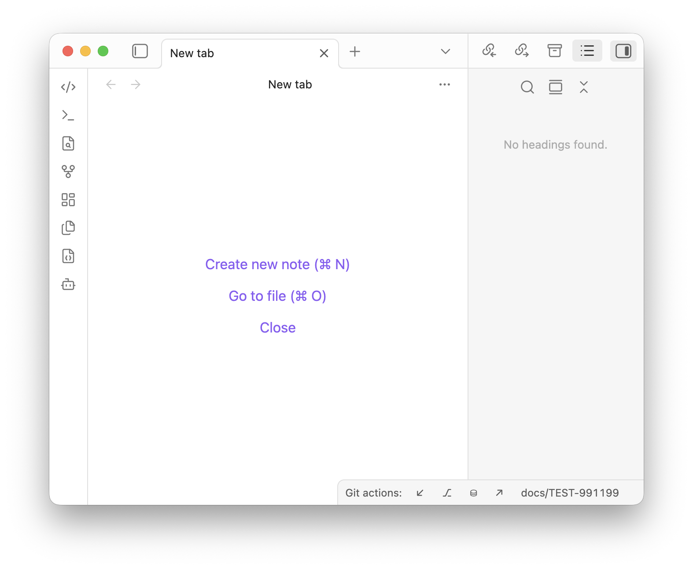
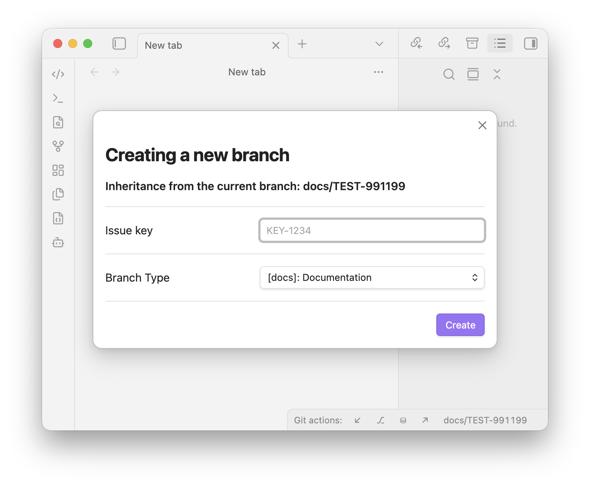
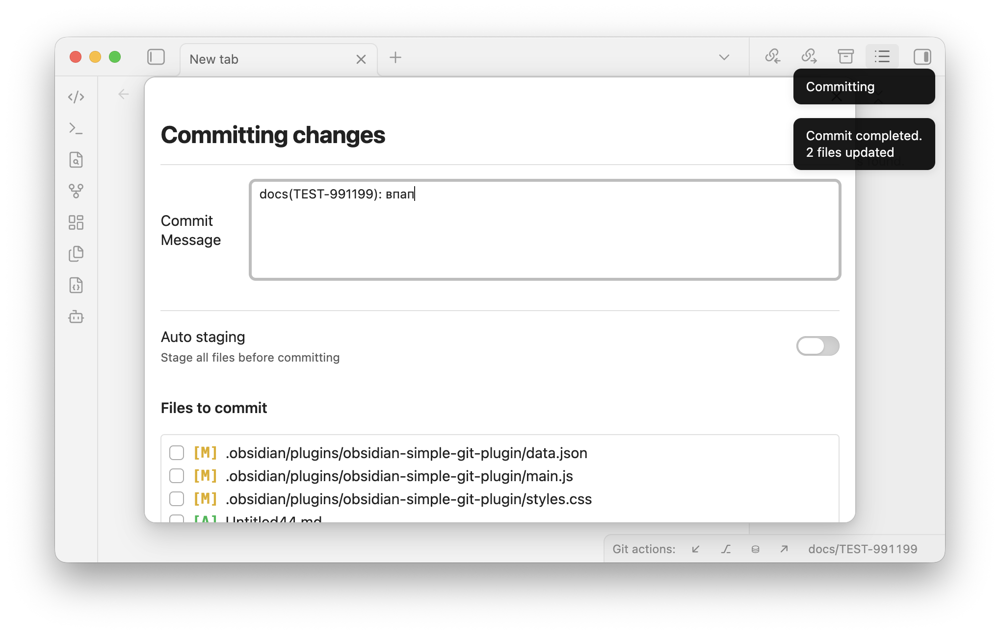
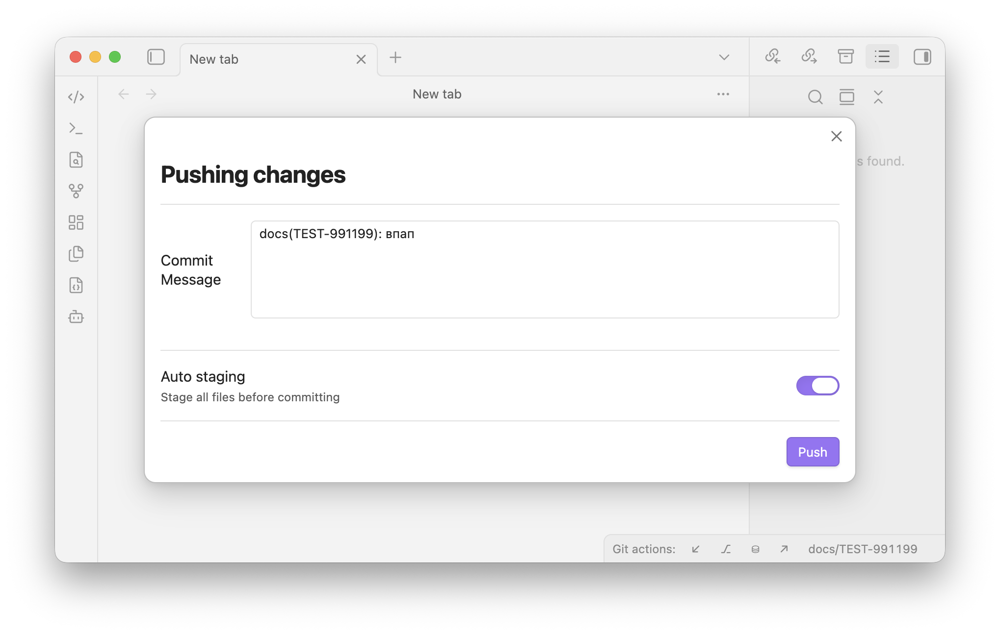
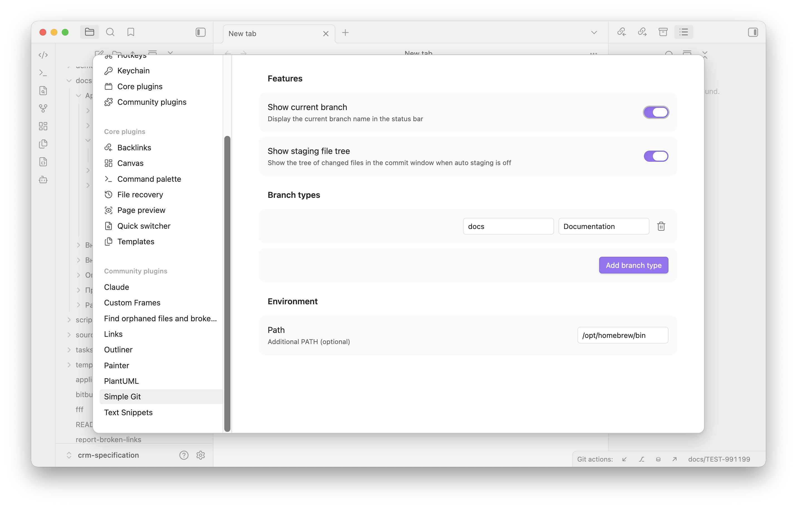

# Obsidian Simple Git Plugin

A lightweight and simple Git client for [Obsidian](https://obsidian.md). It adds a compact set of Git actions to the status bar so you can pull, commit, push, create and switch branches without leaving your vault.

> **Desktop only.** The plugin shells out to your local `git` (and optionally `git-lfs`) executable, so it does not run on Obsidian Mobile.

## Features

All actions live in the status bar under the **Git actions:** label:

| Icon | Action             | Description                                                                                              |
|:----:|--------------------|----------------------------------------------------------------------------------------------------------|
| `↙`  | **Pull**           | Pull updates from the remote repository.                                                                 |
| `⎇`  | **Create branch**  | Pull the current branch, then create and push a new branch (see [Creating a branch](#creating-a-branch)). |
| `⛁`  | **Commit**         | Open the commit window to stage and commit changes (see [Committing & pushing](#committing--pushing)).   |
| `↗`  | **Push**           | Open the commit window, then commit **and** push in one step.                                            |
|`main`| **Current branch** | Shows the current branch name. Click it to switch to another branch with a searchable list.              |

### Creating a branch

Clicking `⎇` opens a dialog where you provide:

- **Issue key** — e.g. `KEY-1234`.
- **Branch type** — chosen from a configurable dropdown (`feature`, `docs`, `release`, `hotfix`, …).

The new branch is named `<type>/<issue-key>` (for example `feature/KEY-1234`), created from the current branch, and pushed to `origin` with upstream tracking.

### Committing & pushing

The commit window (used by both **Commit** and **Push**) lets you:

- Enter a **commit message** (remembered per branch).
- Toggle **Auto staging** — stage every change before committing.
- When auto staging is **off**, pick exactly which files to include from a tree of changed files:
  - Each file shows its full path and a status badge — `[A]` added, `[M]` modified, `[R]` removed.
  - Files already staged are checked by default; tick or untick to adjust what goes into the commit.
  - The list is sorted by full path and scrolls when there are many files.

### Switching branches

Click the current-branch item in the status bar to open a searchable list of local branches (fuzzy search by name) and check out the selected one.

### Git LFS

On startup the plugin detects `git-lfs` and configures the LFS filters automatically. If `git` or `git-lfs` lives in a non-standard location, add its directory under **Settings → Environment → Path**.

## Settings

- **Branch types** — manage the list of branch-type options (value + label) shown when creating a branch. Add or remove entries as needed.
- **Features**
  - **Show current branch** — show or hide the current branch name in the status bar.
  - **Show staging file tree** — show the tree of changed files in the commit window when auto staging is off.
- **Environment**
  - **Path** — an additional `PATH` entry used to locate `git` / `git-lfs`.

## Installation

### From source

1. Clone this repo into your vault's plugins folder: `VaultFolder/.obsidian/plugins/`.
2. Make sure Node.js is at least v16 (`node --version`).
3. Run `npm i` to install dependencies.
4. Run `npm run build` to produce `main.js`.
5. Reload Obsidian and enable **Obsidian Simple Git Plugin** in **Settings → Community plugins**.

### Manual

Copy `main.js`, `styles.css`, and `manifest.json` into `VaultFolder/.obsidian/plugins/obsidian-simple-git-plugin/`, then reload Obsidian and enable the plugin.

## Development

- `npm run dev` — compile in watch mode (rebuilds `main.js` on change).
- `npm run build` — type-check and produce a production build.
- `npm version patch | minor | major` — bump the version in `manifest.json` and `package.json` and update `versions.json`.

## License

MIT
